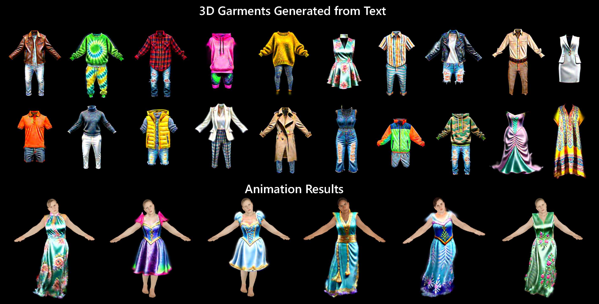
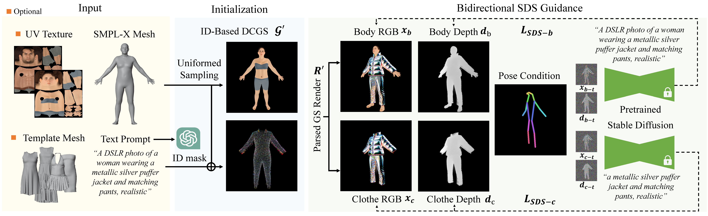

# ClotheDreamer
The official code of ClotheDreamer: Text-Guided Garment Generation with 3D Gaussians

### [Project Page](https://ggxxii.github.io/clothedreamer/) | [Paper (ArXiv)](https://arxiv.org/abs/2406.16815)

[Yufei Liu](https://ggxxii.github.io/)1,
[Junshu Tang](https://junshutang.github.io/)2,
Zheng Chu1,
Shijie Zhang3,
Jinkun Hao2,
Junwei Zhu4,
Dongjin Huang1,

1Shanghai University, 2Shanghai Jiao Tong University, 3 Fudan University 4Tencent Youtu Lab

## :star2: Method
